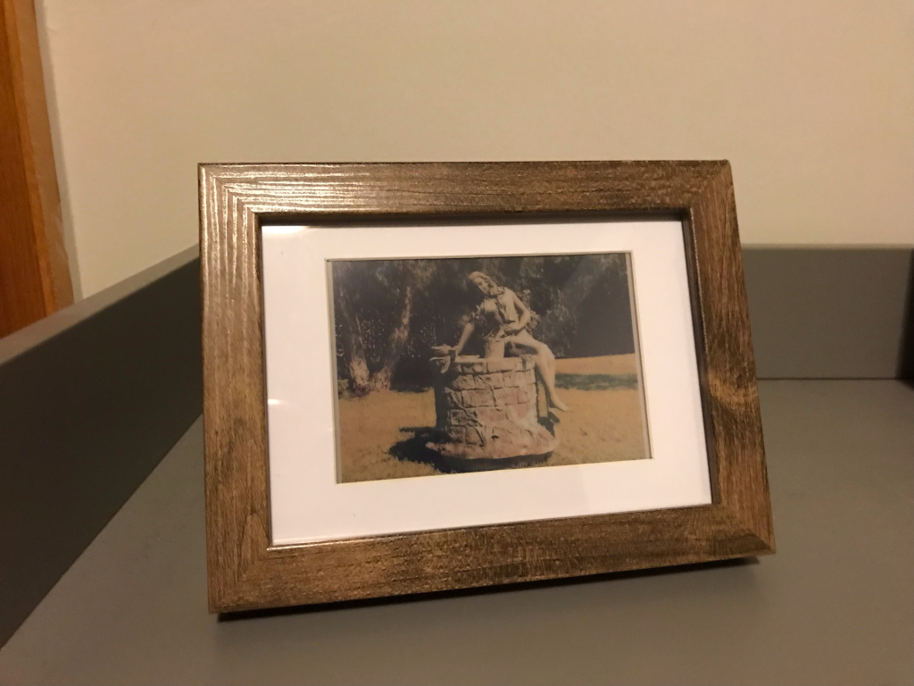
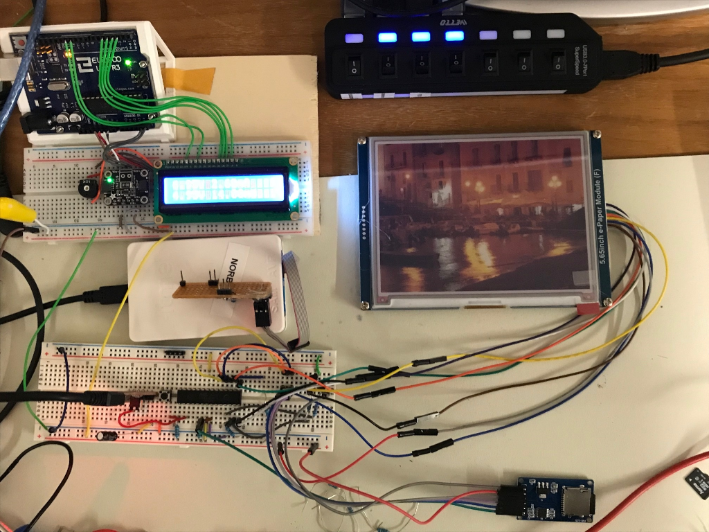
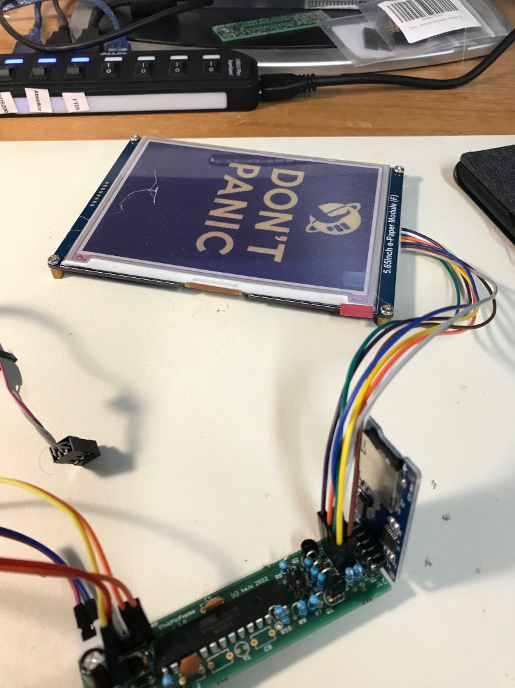
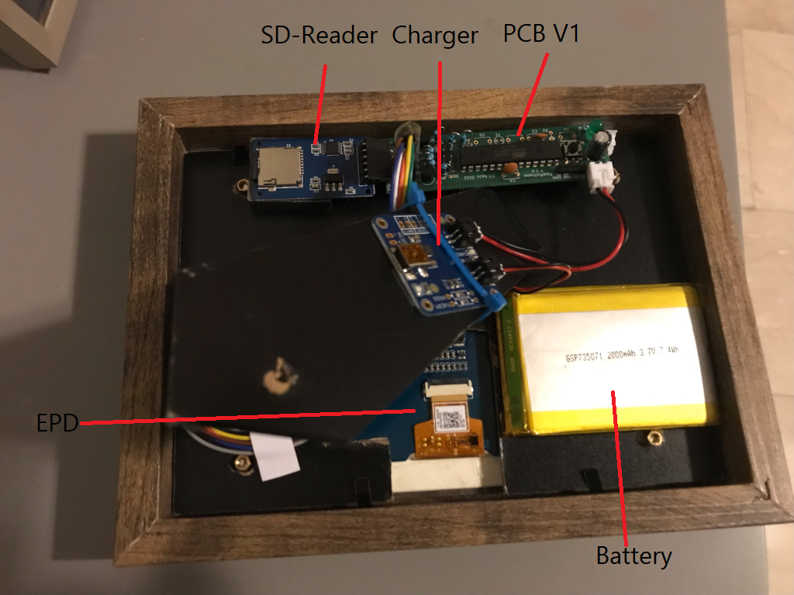

# EInkPicFrame

The project builds an electronic picture frame using a 7 color E-Ink display.
It updates after an adjustable time period by reading images from an SD-Card.
The frame is powered from a battery and mimics a real picture frame by requiring
no power cable or a backlight. The software and hardware implements various power
saving methods to run for a long time without recharging.  

This is a hobbyist project. I have >20 years background in software development,
but lack the electronic engineering background. I'm using this project to
clear the fog in these mysterious regions below a HAL software layer. The project
therefore includes a hardware design as well. Keep this in mind if you plan to
rebuild it. As with any open source, you use this AT YOUR OWN RISK!.

## Requirements

A set of project requirements is collected here: [Requirements](design/Requirements.md)

## Concept

Block diagram of the system:

## Used Tools

The project is build using open source tools only. All of them are available for free. The following table shows the tools and versions used during development:

|Tool                  |   Usage                   | Version   | Link                                                               |
|----------------------|---------------------------|-----------|--------------------------------------------------------------------|
| Visual Studio Code   | Editor and IDE            | 1.63.2    | [https://code.visualstudio.com/](https://code.visualstudio.com/)   |
| PlatformIO           | Softwate bUild tools      | 5.2.4     | [https://platformio.org/](https://platformio.org/)                 |
| Python               | Script programming        | 3.10.1    | [https://www.python.org/](https://www.python.org/)                 |
| GIMP                 | Image Manipulation        | 2.10.30   | [https://www.gimp.org/](https://www.gimp.org/)                     |
| ImageMagick          | Image Manipulation        | 7.1.0     | [https://imagemagick.org/](https://imagemagick.org/)               |
| GIT                  | Version Control           | 2.19      | [https://git-scm.com/](https://git-scm.com/)                       |
| KiCad EDA            | Hardware Design           | 5.1.12    | [https://www.kicad.org//](https://www.kicad.org/)                  |

## Software Architecture

The implemented software architecture design is shown on the [Software Architecture](design/SwArchitecture.md) page.

## Hardware

The system is assembled using the following parts: [Partlist](design/Parts.md).

A description of the PCB developed for this project is described
here: [PCB](design/hardware.md).

## Image Generation

The images to show on the frame must be in a special raw format. The process to generate this format is
described on the [ImageConverter](imgconverter/howto.md) page.

## File System

The SD Card must be formated using a FAT file system. The software
expectes a folder with the name "epd" on it. This folder contains
the following data:

      [epd]
       |---- [err]
       |---- [img]
       |---- epd.cfg

* The folder "err" holds error images that are displayed in case
  of a problem, like "low battery".
* The folder img holds your images in epd format.
* The file epd.cfg are the parameters for the display. See
  [Parameter File](./design/Parameter.md) for instructions to
  create it.

An example file system can be copied from the example
[File System](./design/FileSystem) folder.

## Prototype Progress

* 2021-12-11: System functional on breadboard (V1 hardware)
  

* 2021-01-22: V1 PCBs arrived and work
  

* 2022-02-01: First frame starts long run test in the living room
  

  Back side:

  