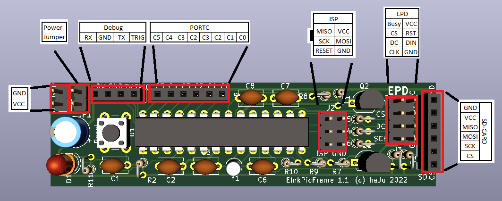

# EInkPicFrame Hardware

This page describes the hardware developed for the EinkPicFrame Project.
The current board revision is 1.1. It got designed using KiCAD. The
schematic and pcb project files are in the [hardware](../hw) folder.

The board is deliberately designed to be as small as possible. It's main
purpose is to hide inside a picture frame. It may even get smaller using
SMD parts. I avoided them as I'm realistic regarding my soldering skills.

## Microcontoller AVR 328PU

The heart of the PCB is the AVR 328PU microcontroller. It gives access to
the following capabilities:

* SPI is used for reading from SD-Card, writing to EPD and ISP programming.
* UART TX/RX - Only TX for debug prints is used, RX input is ignored
* A 32.768 kHz watch crystal on the XTAL pins drives Timer2 to wakeup
  the controller from power safe mode.
* ADC voltages - Reference voltage uses the recommended wiring with a capacitor
  and inductor. It is used for measuring the input voltage for low battery
  indication.
* A reset button is connected to restart the system without power cycling.
* PORT C pins are available on a header, but currently unused. They are for
  future extensions.

The pin usage is detailed on the [Pins](Pins.md) page.

## Connectors

