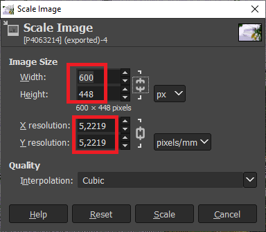

# Image Converter How-To

This document explains image data generation for the Waveshare 5.65inch e-Paper Module. The process has 2 major steps:

  1. Resize and dithering of the image using GIMP
  2. Converting the image into the e-Paper memory format

## Image Manipulation With GIMP

This chapter explains the steps to create images with the right size and
color palette. The GIMP version used for this How-To was 2.10.30.

### Resizing the Image

The image must have the exact size of 600x448 pixels. The can be done using
the *Scale Image* tool from menu:

    Image / Scale Image...

Enter the following values in the "Scale Image" Dialog:

Press "Scale" to resize the image. You may experiment with various "Interpolation" options in order to figure out what works best.

### Dithering the Image

The next step is to convert the image to the reduced color palette of the e-Paper Module using Floyd-Steinberg dithering.

#### Installing the Color Palette

This step needs to be done only once for a GIMP installation. It adds the e-paper color palette to the list of available palettes. 

 1. Open the Palettes Dialog in Gimp from menu

        Window / Dockable Dialogs / Palettes

 2. Right click in the Palettes window and select *Import Palette ...*
    

    Use the palette file from [doc/E-Paper.gpl](doc/E-Paper.gpl).

Now the palette is available in the palettes list:

Note: This palette has 8-Colors defined, but the display only supports  7. But there is indeed an additional one for "cleaning". It means no ink visible and is intended to wipe the pixels between changing images. It  avoids ghosting, but is also a color at the end. The following picture shows the 8 palette colors:

#### Floyd-Steinberg Dithering

This Floyed-Steinberg dithering algorithm converts images to look still good using a reduced color set. In GIMP this algorithm gets applied by converting an image to *Indexed Colors Mode*. The pixels then contain an index into a color palette instead of RGB values.

  1. Switch the image to indexed mode by using menu

          Image / Mode / Indexed...

  2. The *Indexed Color Conversion* dialog appears

     

  3. Select our *Custom E-paper Palette"

  4. Make sure that "Remove unused and duplicate colors..." is NOT checked. We need to keep the palette indexes as they are.

  5. Select a dithering algorithm. You may try different ones to see what works best in your case.

  6. Export the result as Windows BMP file using menu

          File / Export As...

  Select "Windpws BMP Image" from the "Select File Type" list.

### Creating Display Raw Data

The proper sized and dithered image must be converted into the diplay memory format of the display. This is a simple byte stream of color index values. Each byte holds 2 index values, one in the upper 4 bit, the following pixel in the lower 4 bit.

A python script for converting the images into this raw format is available in [here](./epdconv.py). 

#### Script Setup

The sript needs a Python 3.x environment with [Pillow](https://pillow.readthedocs.io/en/stable/index.html). Pillow can be installed using pip:

    python -m pip install --upgrade pip
    python -m pip install --upgrade Pillow

#### Script Excecution

Simply call the Python script with one or more image files as aguments.

    python epdconv.py img000.bmp imgage001.bmp ...

It will create the raw display image files with the same filename and a ".epd" (E-Paper Data) extension on success.

The script does some sanity checks regarding size and color index mode. Unfit image will be skipped.
